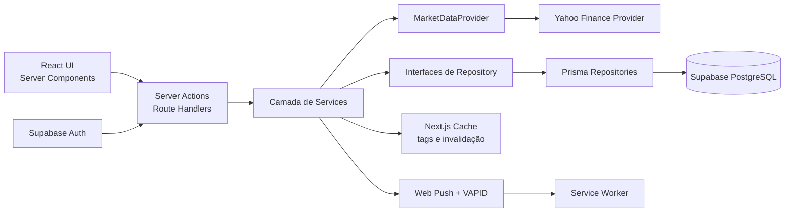

<p align="center">
  
</p>

<h1 align="center">StockWatcher</h1>

<p align="center">
  Acompanhamento de carteira, cotações e alertas de ações da B3 em uma aplicação web responsiva.
</p>

## Sobre o projeto

O StockWatcher é um MVP desenvolvido para centralizar informações relevantes para quem acompanha uma carteira de ações. A aplicação permite pesquisar ativos, registrar posições, visualizar desempenho e distribuição da carteira e criar alertas por preço ou variação diária.

Além das funcionalidades, o projeto foi construído como exercício de arquitetura de software aplicada a um produto real. O foco está na separação de responsabilidades, no baixo acoplamento com serviços externos e no uso dos recursos modernos do Next.js para renderização, cache e mutações no servidor.

> O StockWatcher não é uma corretora e não realiza recomendações ou operações de investimento. As informações exibidas têm finalidade exclusivamente informativa.

## Principais funcionalidades

- Autenticação, criação de conta e recuperação de senha com Supabase Auth.
- Pesquisa de ações da B3 por ticker ou nome da empresa.
- Página do ativo com cotação, variação diária e indicadores fundamentalistas.
- Cadastro, edição e remoção de posições da carteira.
- Resumo de patrimônio, resultado diário, rentabilidade e distribuição por ativo.
- Alertas por preço e por variação diária, com condições acima ou abaixo do alvo.
- Notificações Web Push com suporte a múltiplos dispositivos por usuário.
- Atualização periódica e tolerante a falhas das cotações e dos alertas.
- Interface responsiva para desktop e dispositivos móveis.

## Decisões arquiteturais

### Repositories orientados a contratos

O acesso aos dados é definido por interfaces como `StockRepository`, `AlertRepository`, `UserRepository` e `WalletItemRepository`. Os services dependem desses contratos, e não diretamente do Prisma.

Atualmente, os contratos são atendidos por repositories baseados em Prisma e PostgreSQL. Uma mudança de persistência fica concentrada em novas implementações dessa camada, reduzindo o impacto sobre as regras de negócio e os componentes da aplicação.

### Provider de dados de mercado

As integrações com cotações são encapsuladas pelo contrato `MarketDataProvider`. O provider atual utiliza Yahoo Finance, mas os services trabalham apenas com models internos normalizados.

Essa fronteira permite substituir ou combinar fontes de mercado sem espalhar tipos, respostas ou regras específicas de uma API externa pelo restante do projeto.

Para uma mudança da fonte dos dados de ações, basta fazer uma nova implementação da interface `MarketDataProvider` e o restante do sistema funcionará normalmente

### Services como camada de negócio

Regras de carteira, ações, alertas, autenticação e notificações ficam centralizadas em services. Componentes e Server Actions coordenam a entrada e a apresentação dos dados, enquanto os services cuidam de validações de negócio, cálculos, cache e comunicação com repositories e providers.

### Cache e renderização no servidor

A aplicação utiliza Server Components, Suspense, Server Actions e o cache do Next.js. Dados como carteira, ações, alertas e indicadores recebem tags próprias, permitindo invalidação pontual depois de uma mutação sem descartar todo o cache da aplicação.

### Processamento periódico resiliente

Um endpoint protegido por segredo orquestra o fluxo periódico em duas etapas:

1. Atualiza e persiste as cotações.
2. Avalia e dispara os alertas usando apenas os preços atualizados com sucesso.

Falhas individuais são isoladas com processamento em lote, evitando que um ativo indisponível interrompa a atualização dos demais. O endpoint também respeita o calendário e o horário da B3, com uma margem após o fechamento para capturar a última cotação sem consumir a API durante períodos ociosos.

Atualmente o endpoint é chamado a cada 5 minutos, via Cron Job do lado do banco de dados. Garantindo que as cotações fiquem atualizadas, e ao mesmo tempo economizando chamadas desnecessárias a API do mercado. No intervalo entre as chamadas do cron, os dados da ultima cotação atualizada são servidos pelo cache do next a todos os usuário, e persisstidos no banco de dados

### Web Push desacoplado

As inscrições dos navegadores são persistidas separadamente do envio das mensagens. O `WebPushService` utiliza VAPID e trata cada dispositivo de forma independente, enquanto o Service Worker recebe e exibe a notificação.

Subscriptions expiradas são removidas automaticamente, e uma falha de entrega não desfaz o alerta nem bloqueia notificações destinadas aos outros dispositivos do usuário.

## Visão da arquitetura



Os arquivos `index.ts` das camadas de provider e repository funcionam como pontos de composição. É neles que a implementação concreta é associada ao respectivo contrato.

## Tecnologias

- Next.js 16 e React 19
- TypeScript
- Tailwind CSS 4 e Material UI
- Prisma ORM 7
- PostgreSQL no Supabase
- Supabase Auth com suporte a SSR
- Zod para validação das entradas
- Web Push, VAPID e Service Worker
- Yahoo Finance como provider atual de mercado
- Vercel para deploy da aplicação
- Supabase Cron para atualização periódica

## Organização do projeto

```text
src/
├── actions/         # Server Actions e validação de mutações
├── app/             # Rotas, layouts e Route Handlers do App Router
├── components/      # Componentes de interface e estados de loading
├── lib/             # Services, providers e integrações externas
├── models/          # Modelos internos compartilhados pela aplicação
├── repositories/    # Contratos e implementações de persistência
└── utils/           # Formatação, calendário da B3 e utilitários

prisma/
├── migrations/      # Histórico de evolução do banco
└── schema.prisma    # Modelagem da persistência atual
```

## Executando localmente

### Pré-requisitos

- Node.js compatível com Next.js 16
- Banco PostgreSQL
- Projeto no Supabase para autenticação
- Chaves VAPID caso queira testar notificações push

### Instalação

```bash
git clone <url-do-repositorio>
cd stockwatcher
```

Antes de instalar as dependências, crie um arquivo `.env` com as variáveis necessárias. O `postinstall` gera o Prisma Client e precisa encontrar a conexão direta configurada:

```env
# Aplicação e Prisma
DATABASE_URL="postgresql://..."
DIRECT_URL="postgresql://..."

# Supabase Auth
NEXT_PUBLIC_SUPABASE_URL="https://seu-projeto.supabase.co"
NEXT_PUBLIC_SUPABASE_PUBLISHABLE_KEY="..."

# Endpoint periódico
CRON_SECRET="..."

# Web Push
NEXT_PUBLIC_VAPID_PUBLIC_KEY="..."
VAPID_PRIVATE_KEY="..."
VAPID_SUBJECT="mailto:contato@exemplo.com"

# Opcional: tolerância usada na avaliação dos alertas
ACCEPTED_TOLERANCE_PERCENT="2"
```

Instale as dependências, prepare o banco e inicie o servidor:

```bash
npm install
npx prisma migrate deploy
npm run dev
```

A aplicação estará disponível em [http://localhost:3000](http://localhost:3000).

> Web Push exige um contexto seguro. Em produção, utilize HTTPS; durante o desenvolvimento, `localhost` é tratado como origem segura pelos navegadores compatíveis.

## Possíveis evoluções

- Testes unitários e de integração para services, repositories e providers.
- Fallback de notificações por e-mail.
- Suporte a alertas recorrentes de preço
- Observabilidade dos jobs de atualização e entrega de notificações.
- Suporte a novas classes de ativos e outras fontes de dados de mercado.
- Atualização automatizada do calendário anual de negociação da B3.
